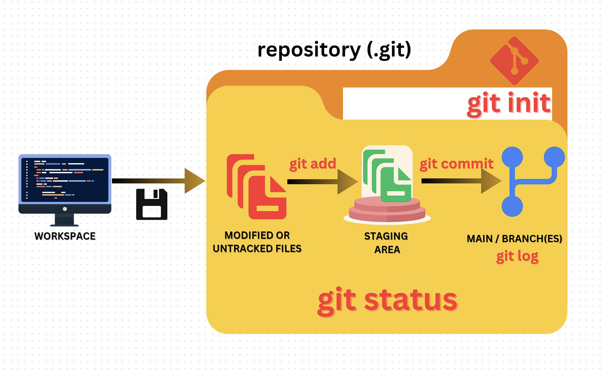

## The Git Repository

- A repository, or *repo* for short, is just a folder where your project files are stored.
- This is a special folder that's been *initialized* using `Git`. ANY files or folders / subfolders that you will create or put inside this repository will be tracked by `Git` for changes, but it is possible to have `Git` **ignore** any files or folders in the repository that you don't want to get tracked (more on this later).
- When a folder is converted, or *initialized*, into a `Git` repository, `Git` will create a hidden folder (`.git/`) inside of that folder, where the `Git` files are stored.
- It is possible to have more than one repository in a user's computer, but a `Git` repository should never be put inside another `Git` repository!
- Each project that you build should be in its own *separate* repository. Don't use one common repository for several projects!

 

    
    
<i>A typical Git workflow diagram</i>

<table align="center">
   <tbody>
      <tr>
        <td>
            << Start: <a href="/README.md">README.md</a>
        </td>
        <td>
            < Previous: <a href="/assets/s3/ch10.md">File / Folder Operations</a>
        </td>
        <td>
            Next: <a href="/assets/s4/ch12.md">Git Operation: Check Repository Status</a> >
        </td>
      </tr>
   </tbody>
</table>