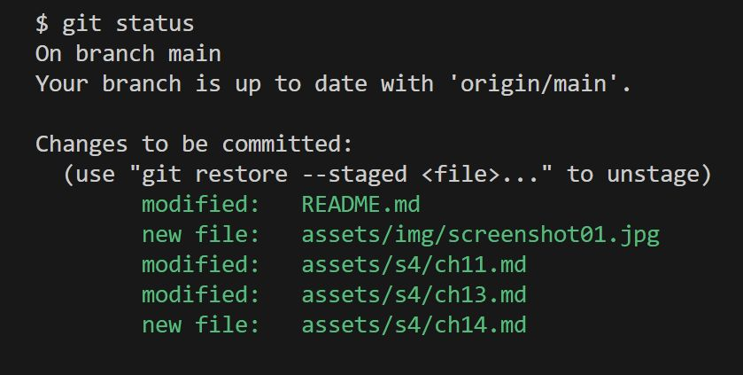

## Git Operation: Staging

<div align="center">
    
</div>
<br>

- It is the process of grouping files together based on a common theme of changes that were done during coding/editing. The user gets to decide which file(s) they want to *stage*, and accomplishes this by using the `git add` command:
```shell
$ git add <filename1> <filename2 etc.>
# Example: git add notes.txt
# Example: git add index.html style.css script.js
```

- Before staging, confirm first that there are actually *untracked/modified files* to be staged. This is done using `git status`. Example:
```shell
$ git status
```

<div align="center">
    
</div>
<br>

- <u>Power Tip</u>: If you want to add ALL modified/untracked files to the staging area in one go, do the following:
```shell
$ git add .
```

- Once you have staged the files, when you run `git status` again, the output will be different:

<div align="center">
    
</div>

<hr>

<table align="center">
   <tbody>
      <tr>
        <td>
            << Start: <a href="/README.md">README.md</a>
        </td>
        <td>
            < Previous: <a href="/assets/s4/ch14.md">The Git Workflow</a>
        </td>
        <td>
            Next: <a href="/assets/s4/ch16.md">Git Operation: Committing</a> >
        </td>
      </tr>
   </tbody>
</table>