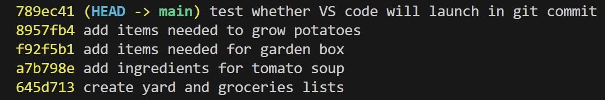

## Checking the Commit Log

### git log
- Displays a list of the entire history of commits in a given repository.
```shell
$ git log
```

- Sample output:

<div align="center">
    
</div>

- Each commit log consists of the following information:
  - the commit hash
  - the branch pointer (*HEAD -> main*; more on this later)
  - the user name and email
  - the date and time of the commit
  - the commit message

- The commit log history is displayed from newest (most recent) to oldest commits.
- If the commit log is too long and doesn't fit in the terminal window, it will pause the output at the bottom of the window, with a colon `:` indicator to designate that there are still more lines to display. Press and hold the *down arrow* key to let the display scroll down and reveal the rest of the commit history. Once you reach the end of the commit history, the indicator will change to `(END)`. Press `Q` to exit the log and go back to the normal terminal prompt.

- To view a more concise version of the commit history (with less details), use the `--oneline` switch:
```shell
$ git log --oneline
```

- Sample output of `git log --oneline`:

<div align="center">
    
</div>

<hr>

<table align="center">
   <tbody>
      <tr>
        <td>
            << Start: <a href="/README.md">README.md</a>
        </td>
        <td>
            < Previous: <a href="/assets/s4/ch16.md">Committing</a>
        </td>
        <td>
            Next: <a href="#">TBA</a> >
        </td>
      </tr>
   </tbody>
</table>